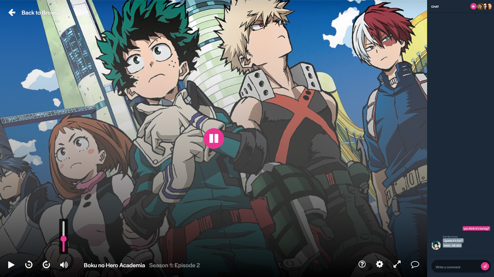

## Care.tv
Care.tv makes it really easy to enjoy movies or watch TV shows with the people you care about, no matter how far!

Works for mobile, tablet, and desktop screens. Does not work with iOS at the moment.

## API Setup
You will have to install these dependencies: [MySQL `5.7`](https://dev.mysql.com/downloads/mysql/5.7.html), [php `>=7.2`](https://thishosting.rocks/install-php-on-ubuntu/) along with [Composer](https://getcomposer.org/), and [ngrok](https://ngrok.com)

- Move to the `api` folder.
```bash
cd api
```
- Install the dependencies
```bash
composer install
```

- Copy `.env.example` to `.env`, and setup your environment config. Particularly, the database credentials (`DB_*`).
```bash
cp .env.example .env
```

- Open up `.env`, then configure the cdn url & request access code
```bash
# Where your media is stored
APP_CDN=https://your-digital-ocean-cdn.sgp1.cdn.digitaloceanspaces.com/

# This is used for the registration, but you can leave empty.
APP_REQUEST_ACCESS_CODE=
```

- Publish unique key for Laravel.
```bash
php artisan key:generate
```

- Run the migrations. Don't forget to store the client id and secret output from running `php artisan passport:client`.
```bash
php artisan migrate
php artisan db:seed && php artisan db:seed --class=ShowSeeder
php artisan passport:install
php artisan passport:client --password
```

- [Setup `ngrok`](https://dashboard.ngrok.com/get-started), then point it to port `8000`.
```bash
ngrok http 8000
```

- Setup [Pusher](https://pusher.com/) by logging in to its dashboard, and creating a client. When you're done, open up `.env`, and change the following with the details provided by Pusher:
```bash
PUSHER_APP_ID=
PUSHER_APP_KEY=
PUSHER_APP_SECRET=
PUSHER_APP_CLUSTER=
```

- Go to the _Web Hooks_ tab, then paste ngrok's generated url (e.g., `http://9542199e.ngrok.io `) to the _Webhook URL_ input.

- Select _Presence_ for the _Event Type_, then press _Add_.

- You should be good to go
```bash
php artisan serve
```

## Front-end setup
You will need npm `>=6` and Node.js `>=11`.

- Move to the `ui` folder
```bash
cd ui
```

- Install the dependencies
```bash
npm i
```

- Copy `.env.example` to `.env`, and setup your environment config. Update the `API_CLIENT_*` based on the output from `php artisan passport:client --password` (refer to instructions above).
```bash
cp .env.example .env
```

- Start Parcel, and you're all good.
```bash
npm start
```

It should open up to your a new browser window shortly. However, if it doesn't, you can manually open http://localhost:3000.

## Deployment
The API and front-end are deployed separately.

### API
Currently, Pulse is deployed on Laravel Forge. For the initial deployment, don't forget to run:
```bash
php artisan passport:install
php artisan passport:client --password
```

### Front-end
The web interface is hosted on Netlify for free.
- Set the root folder to `ui`; the public folder to `dist`.
- Set the environment config accordingly.
- For the build command:
```bash
npm run build
```

## Custom API Commands
```bash
# Lists the most recent parties since 3 days ago
php artisan app:list-pt
# Lists the most recent parties since 5 days ago
php artisan app:list-pt 5

# Lists the last 15 registrations
php artisan app:list-users
# Lists the last 30 registrations
php artisan app:list-users 30
```

## Attribution
- [DrawKit](https://www.drawkit.io/illustrations/drawing-woman-colour) for the free illustrations pack.
- [Notification Sounds](https://notificationsounds.com/sound-effects) for the notification audio files.
